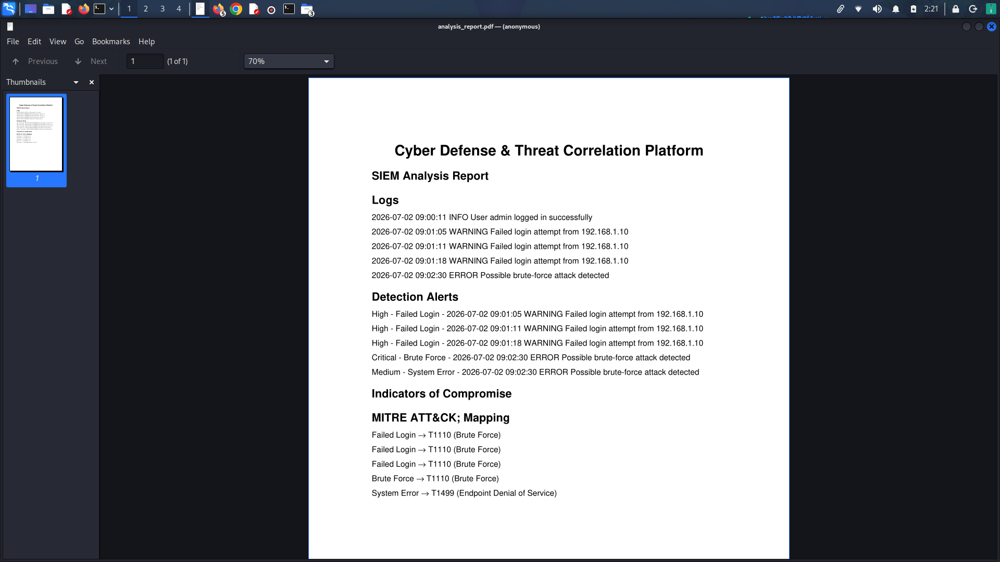
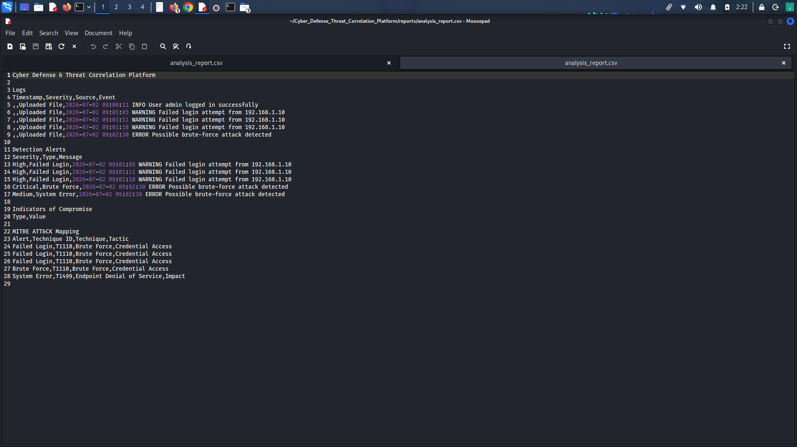
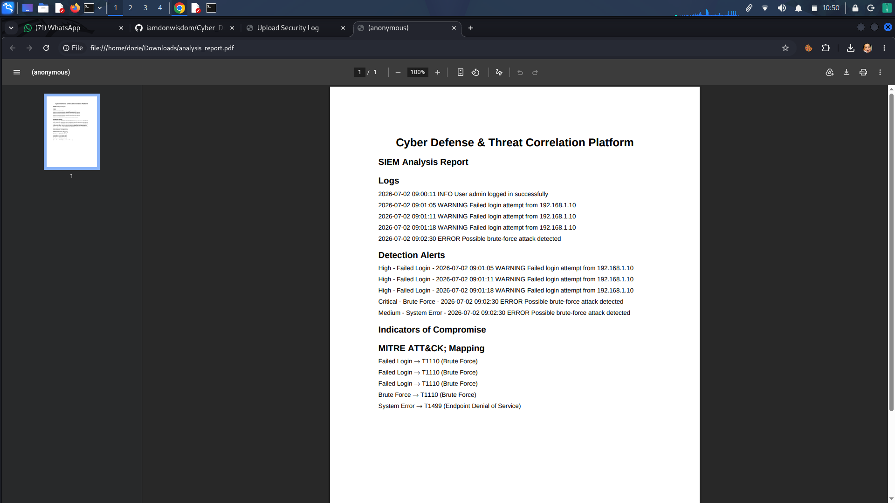
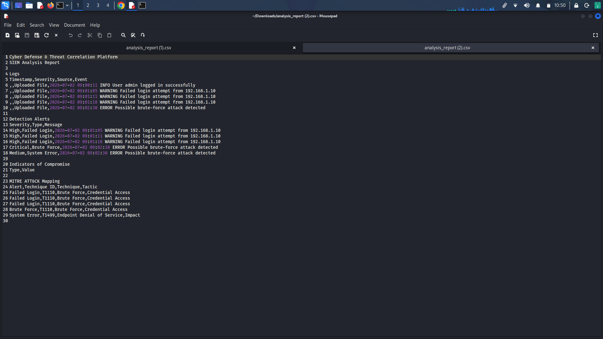
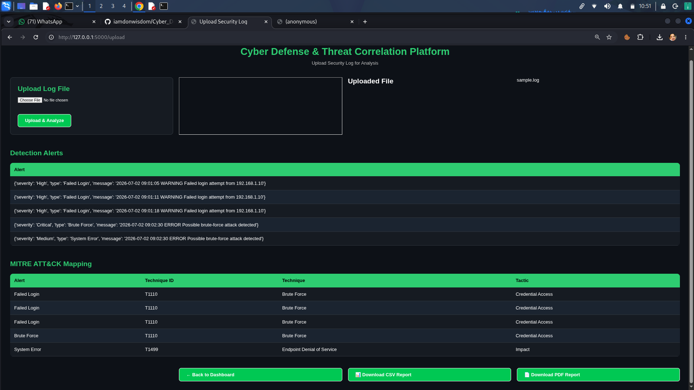
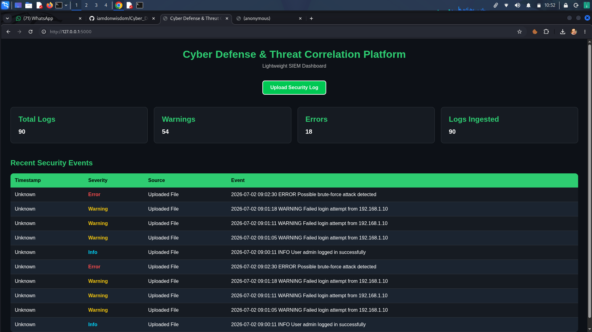

# Cyber Defense & Threat Correlation Platform

A lightweight Security Information and Event Management (SIEM) platform built with Python and Flask that automates security log analysis, threat detection, IOC extraction, MITRE ATT&CK mapping, and professional report generation.

---

## Overview

The Cyber Defense & Threat Correlation Platform is designed to simulate core SIEM capabilities used by Security Operations Centers (SOCs).

It allows analysts to upload security log files, automatically detect suspicious events, extract Indicators of Compromise (IOCs), correlate findings with threat intelligence, map attacks to the MITRE ATT&CK Framework, and generate downloadable CSV and PDF reports.

---

## Features

- Upload security log files
- Parse log entries automatically
- Detect suspicious security events
- Failed login detection
- Brute-force attack detection
- System error detection
- IOC Extraction
- Threat Intelligence Lookup
- MITRE ATT&CK Mapping
- Dashboard with security statistics
- CSV Report Generation
- PDF Report Generation
- Downloadable reports
- Responsive Flask web interface

---

## Technology Stack

- Python 3
- Flask
- SQLite
- HTML5
- CSS3
- Jinja2
- ReportLab
- CSV
- Regular Expressions

---

## Project Structure

```
Cyber_Defense_Threat_Correlation_Platform/
│
├── app.py
├── config/
├── database/
├── intelligence/
├── logs/
├── modules/
│   ├── detection/
│   ├── ioc/
│   ├── mitre/
│   ├── reports/
│   └── threat_intel/
├── reports/
├── sample_logs/
├── screenshots/
├── static/
├── templates/
├── uploads/
├── README.md
└── LICENSE
```

---

## Installation

Clone the repository

```bash
git clone https://github.com/iamdonwisdom/Cyber_Defense_Threat_Correlation_Platform.git
```

Enter the project

```bash
cd Cyber_Defense_Threat_Correlation_Platform
```

Create virtual environment

```bash
python -m venv venv
```

Activate it

Linux

```bash
source venv/bin/activate
```

Install dependencies

```bash
pip install flask reportlab
```

Run the application

```bash
python app.py
```

Open

```
http://127.0.0.1:5000
```

---

# Screenshots

## Dashboard



---

## Upload Log Page



---

## Detection Alerts



---

## IOC Extraction



---

## MITRE ATT&CK Mapping



---

## Reports



---

# Detection Capabilities

The platform currently detects:

- Failed Login Attempts
- Brute Force Attacks
- System Errors
- Indicators of Compromise (IOCs)
- MITRE ATT&CK Techniques

---

# Generated Reports

After each analysis the platform automatically generates:

- CSV Report
- PDF Report

Both reports are downloadable directly from the web interface.

---

# Future Improvements

- Real-time Log Monitoring
- VirusTotal Integration
- AbuseIPDB Integration
- GeoIP Lookup
- Email Alerts
- Interactive Charts
- User Authentication
- Docker Support
- REST API
- Elasticsearch Integration
- Splunk Forwarding
- Sigma Rule Support
- YARA Rule Support

---

# License

This project is released under the MIT License.

---

## Author

**Ede Chidozie Philip**

Cybersecurity | SOC | Threat Detection | Python | Flask | SIEM Development

GitHub:
https://github.com/iamdonwisdom
